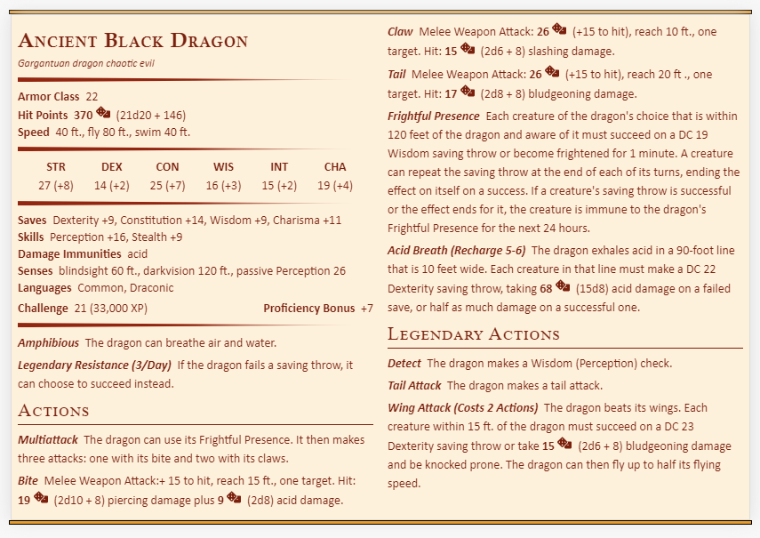

# Fantasy Statblocks
*A Table Top Roleplaying Plugin to Access the Create and Manage your Statblock Layouts within [Obsidian.md](https://obsidian.md).

Fantasy Statblocks makes up a small part of the Valantasy System

<i>Dungeons & Dragons, 5th Edition Statblock in Fantasy Statblocks</i>

## Requirements

To gain the full utilization of Fantasy Statblocks, you will need the following additional Community Plugins.

> [Fantasy Bestiary](https://github.com/valentine195/fantasy-bestiary): which stores the raw bestiary data for the Statblocks after they have been imported or created.  {: .new }

- [Initiative Tracker](https://github.com/valentine195/obsidian-initiative-tracker): A plugin which tracks initiatives and the status of the enemies and players during an encounter, and supports pulling the enemy database from the Fantasy system. 
- [Dice Roller](https://github.com/valentine195/obsidian-dice-roller): A plugin which adds the ability to render complicated dice functions within Obsidian. Within the Valantasy Statblocks, certain damage, healing, and modifiers become clickable dice.
